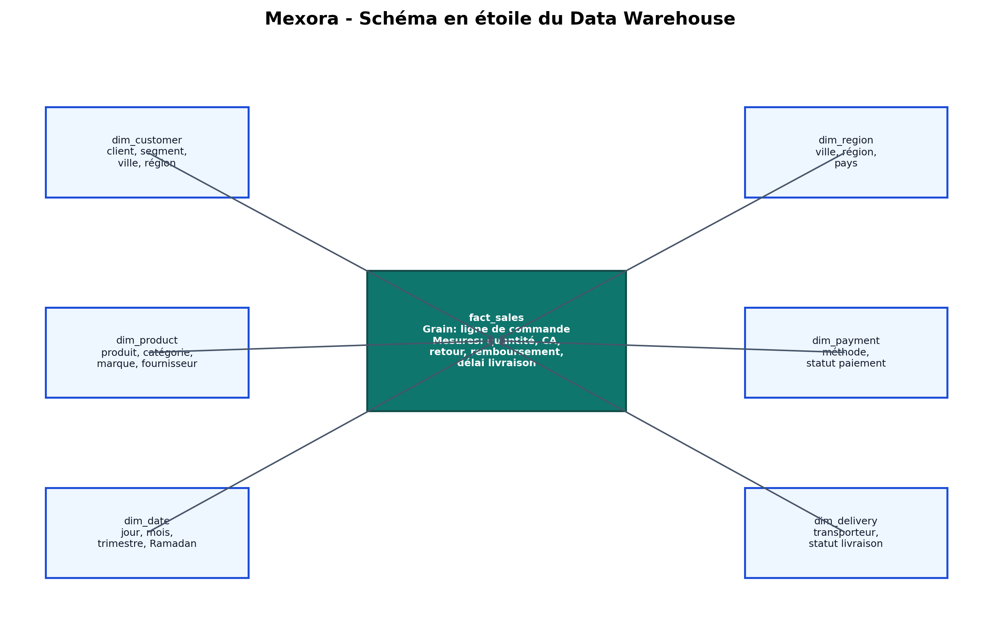

# 1. Page de garde

**Titre :** Mini-Projet 1 — Pipeline ETL & Data Warehouse pour Mexora  
**Module :** Business Intelligence / Data Warehouse  
**Étudiant :** Soufiane ZAARI  
**Année universitaire :** 2025–2026  
**Date de rendu :** avant le 1er Juin 2026  
**Repository GitHub :** à compléter

\newpage

# 2. Résumé exécutif

Mexora est une marketplace e-commerce fictive basée à Tanger. Son activité génère des données opérationnelles liées aux clients, produits, commandes, paiements, livraisons et retours. Ces données sont utiles au suivi quotidien, mais leur exploitation directe dans une base transactionnelle devient rapidement limitée lorsque la direction souhaite analyser les ventes par mois, région, catégorie ou segment client.

Ce projet propose une chaîne décisionnelle complète : une base transactionnelle MySQL `mexora_oltp`, un pipeline ETL développé en Python, une zone de fichiers raw CSV, une transformation Pandas, un Data Warehouse MySQL `mexora_dw` organisé en schéma en étoile, des requêtes analytiques MySQL et un dashboard final Metabase BI.

Les résultats validés montrent un entrepôt chargé avec 9061 lignes dans `fact_sales`, 1000 clients, 300 produits et 5000 commandes. Le pipeline a détecté 1559 anomalies, dont 1196 corrigées et 363 supprimées ou isolées. Les contrôles finaux confirment 0 montant négatif, 0 quantité invalide et 0 fait sans dimension correspondante dans la table de faits.

Le rendu inclut aussi les livrables académiques explicitement demandés : les quatre fichiers sources bruts (`commandes_mexora.csv`, `produits_mexora.json`, `clients_mexora.csv`, `regions_maroc.csv`), une structure Python `mexora_etl/`, un schéma entité-relation annoté, des scripts SQL de création et de contrôle, des tables de reporting matérialisées sous MySQL, une variante PostgreSQL de référence et des documents PDF de justification et d'insights.

# 3. Introduction

La Business Intelligence consiste à transformer des données opérationnelles en informations exploitables pour la décision. Dans une entreprise e-commerce, les données sont produites en continu par les ventes, les paiements, les livraisons et les retours. Ces données sont d'abord enregistrées dans un système OLTP, optimisé pour les transactions courtes et fiables.

Un système OLAP ou Data Warehouse répond à un autre besoin. Il organise les données pour l'analyse, l'agrégation et la visualisation. La différence entre OLTP et OLAP est donc centrale : l'OLTP sert à gérer l'activité, tandis que l'OLAP sert à comprendre cette activité.

Le Data Warehouse joue ici le rôle d'une couche décisionnelle stable. Il permet de construire des indicateurs comme le chiffre d'affaires, le panier moyen, le taux de retour et le délai moyen de livraison. Le dashboard Metabase complète cette démarche en donnant une lecture visuelle et interactive des performances de Mexora.

# 4. Contexte métier de Mexora

Mexora est une marketplace basée à Tanger et orientée vers le marché marocain. Elle vend des produits dans trois familles principales :

- électronique ;
- mode ;
- alimentation.

L'entreprise traite des commandes provenant de plusieurs villes et régions marocaines : Tanger, Tétouan, Casablanca, Rabat, Fès, Marrakech, Agadir, Oujda, Al Hoceïma, Kénitra, Meknès et Nador.

Le Directeur Général souhaite disposer d'une vision rapide et fiable des performances commerciales. Les questions métier portent notamment sur les meilleurs clients à Tanger, les catégories les plus performantes pendant Ramadan, les ventes par région, le taux de retour et les délais de livraison.

# 5. Problématique

La base transactionnelle MySQL est adaptée aux opérations quotidiennes : enregistrer une commande, suivre un paiement, gérer une livraison ou déclarer un retour. Cependant, elle est moins adaptée aux analyses décisionnelles fréquentes, car ces analyses exigent de nombreuses jointures et agrégations.

Mexora doit pouvoir répondre rapidement à des questions comme :

- quels sont les meilleurs clients à Tanger ?
- quelle catégorie performe le mieux pendant Ramadan ?
- quel est le taux de retour par région ?
- quel est le chiffre d'affaires par mois, région et catégorie ?
- quel est le panier moyen ?
- quels produits sont les plus vendus ou les plus retournés ?

La problématique consiste donc à passer d'un système transactionnel à un système décisionnel fiable, documenté et exploitable dans un dashboard BI.

# 6. Objectifs du projet

Le projet poursuit plusieurs objectifs complémentaires :

1. générer des données e-commerce réalistes dans un contexte marocain ;
2. créer une base transactionnelle MySQL `mexora_oltp` ;
3. injecter volontairement des anomalies de qualité ;
4. extraire les données avec Python et SQLAlchemy ;
5. nettoyer et transformer les données avec Pandas ;
6. charger un Data Warehouse MySQL `mexora_dw` ;
7. modéliser un schéma en étoile ;
8. produire des requêtes analytiques MySQL ;
9. construire un dashboard final Metabase ;
10. rédiger un rapport PDF académique et professionnel.

# 7. Architecture générale

```text
MySQL OLTP mexora_oltp
        ↓
Extraction Python
        ↓
Zone raw CSV
        ↓
Transformation Pandas
        ↓
Data Warehouse MySQL mexora_dw
        ↓
SQL Analytics
        ↓
Dashboard Metabase BI
        ↓
Rapport PDF
```

Cette architecture répond au cahier de charge en séparant clairement les responsabilités. La base OLTP conserve les données transactionnelles. L'ETL extrait, nettoie et intègre les données. Le Data Warehouse organise les informations pour l'analyse. Les requêtes SQL répondent aux besoins métier, et Metabase restitue les indicateurs dans une interface BI.

L'environnement MySQL validé est une instance isolée sur `127.0.0.1:3307`. Elle utilise les bases `mexora_oltp` et `mexora_dw`. Cette solution contourne le verrouillage du MySQL système sans abandonner MySQL comme moteur principal.

## 7.1 Conformité PostgreSQL du cahier de charge

Le cahier de charge recommande PostgreSQL pour le Data Warehouse. Dans ce rendu, l'exécution de bout en bout a été validée avec MySQL isolé, car le système transactionnel du projet est MySQL et l'environnement local disponible permet une reproduction fiable sur `127.0.0.1:3307`.

Pour respecter la demande académique, une implémentation PostgreSQL de référence est fournie dans `sql/postgres/`. Elle contient les schémas `staging_mexora`, `dwh_mexora` et `reporting_mexora`, les dimensions `DIM_TEMPS`, `DIM_PRODUIT`, `DIM_CLIENT`, `DIM_REGION`, `DIM_LIVREUR`, la table `FAIT_VENTES`, les index et les vues matérialisées natives demandées. Sous MySQL, les vues matérialisées sont simulées par des tables de reporting rafraîchissables dans `sql/06_reporting_views_mysql.sql`, car MySQL ne possède pas de commande `CREATE MATERIALIZED VIEW` native.

Cette décision est donc un choix d'architecture assumé : PostgreSQL est couvert par les scripts conformes au cahier de charge, tandis que la chaîne locale validée et démontrable reste MySQL.

## 7.2 Livrables du cahier de charge couverts

| Livrable demandé | Réalisation dans le dépôt |
|---|---|
| L1 Schéma entité-relation annoté | `report/assets/schema_etoile_mexora.png` et `docs/er_schema_mexora.mmd` |
| L2 Document de justification | `docs/modeling_justification.md` et `docs/modeling_justification.pdf` |
| L3 Code Python ETL complet | `scripts/` pour l'exécution validée et `mexora_etl/` pour la structure académique |
| L4 Rapport des transformations | `docs/rapport_transformations.md` |
| L5 Script SQL création DWH | `sql/03_dw_schema.sql`, alias `sql/create_dwh.sql`, variante `sql/postgres/01_create_dwh.sql` |
| L6 Script SQL intégrité | `sql/05_quality_checks.sql`, alias `sql/check_integrity.sql`, variante `sql/postgres/02_check_integrity.sql` |
| L7 Dashboard final | Metabase `Mexora BI Dashboard`, généré par API |
| L8 Insights métier | `docs/insights_metier.md` et `docs/insights_metier.pdf` |

# 8. Modèle transactionnel OLTP

Le modèle OLTP représente le fonctionnement opérationnel de Mexora.

| Table | Rôle |
|---|---|
| `customers` | Informations clients : identité, email, téléphone, ville, région, genre et date de naissance. |
| `products` | Catalogue produits : catégorie, sous-catégorie, marque, fournisseur et prix. |
| `orders` | Commandes passées par les clients, avec date, statut et montant. |
| `order_items` | Lignes de commande, au niveau produit, quantité, prix unitaire et remise. |
| `payments` | Paiements associés aux commandes : méthode, statut, date et montant payé. |
| `deliveries` | Informations de livraison : ville, région, transporteur, statut, dates d'expédition et de livraison. |
| `returns` | Retours et remboursements : produit retourné, raison, date et montant remboursé. |

Ce modèle est normalisé et adapté aux transactions. Il devient cependant plus lourd pour les analyses, d'où la nécessité du Data Warehouse.

# 9. Génération des données

Le script `scripts/generate_data.py` produit des données artificielles mais réalistes. Les volumes validés sont les suivants :

| Entité | Volume |
|---|---:|
| customers | 1000 |
| products | 300 |
| orders générées | 5050 |
| orders chargées après suppression des doublons | 5000 |
| order_items | 9424 |
| payments | 5000 |
| deliveries | 5000 |
| returns | 738 |

Les données couvrent des villes et régions marocaines, des catégories produit comme Electronics, Fashion et Food, ainsi que plusieurs méthodes de paiement : Cash on Delivery, Credit Card, Bank Transfer et Wallet.

Des anomalies intentionnelles sont injectées pour rendre le projet plus réaliste : emails invalides, emails dupliqués, villes écrites de plusieurs façons, statuts incohérents, prix aberrants, quantités invalides et livraisons avant commandes.

En complément, `scripts/generate_academic_assets.py` génère les fichiers bruts demandés dans l'énoncé :

| Fichier académique | Volume / contenu | Problèmes injectés |
|---|---|---|
| `commandes_mexora.csv` | 50 000 lignes | doublons, dates mixtes, villes incohérentes, livreurs manquants, quantités négatives, prix à 0, statuts `OK/KO/DONE` |
| `produits_mexora.json` | 300 produits | casse incohérente, prix catalogue manquants, produits inactifs |
| `clients_mexora.csv` | 1000 clients | doublons email, sexe hétérogène, emails invalides, âges invalides |
| `regions_maroc.csv` | référentiel villes/régions | fichier propre servant à la standardisation géographique |

Cette double génération permet de concilier deux besoins : une chaîne MySQL complète et exécutable, et une conformité documentaire avec les fichiers bruts explicitement décrits dans le cahier de charge.

# 10. Qualité des données

La qualité des données est un enjeu central du projet. Les données générées ne sont pas supposées être parfaites ; elles simulent des erreurs fréquentes dans un système transactionnel réel.

| Type d'anomalie | Exemple | Traitement appliqué | Résultat |
|---|---|---|---|
| Email invalide | `client_at_mail` | Remplacement par un email technique unique | Corrigé |
| Email dupliqué | même email pour deux clients | Génération d'un email unique | Corrigé |
| Ville incohérente | `TANGER`, `tng`, `Tangier` | Standardisation vers `Tanger` | Corrigé |
| Région incohérente | `TTA`, `Tanger Tetouan` | Standardisation vers `Tanger-Tétouan-Al Hoceïma` | Corrigé |
| Statut incohérent | `DONE`, `OK`, `Livré`, `KO` | Mapping vers les statuts standards | Corrigé |
| Quantité invalide | `0` ou valeur négative | Suppression de la ligne avant `fact_sales` | Supprimé |
| Prix invalide | prix négatif ou aberrant | Correction par valeur médiane de catégorie | Corrigé |
| Date incohérente | format multiple ou date impossible | Conversion ISO ou correction contrôlée | Corrigé |
| Livraison avant commande | date de livraison antérieure | Délai mis à `NULL` ou corrigé selon règle | Corrigé |

Résultats qualité validés :

| Indicateur qualité | Valeur |
|---|---:|
| anomalies détectées | 1559 |
| anomalies corrigées | 1196 |
| anomalies supprimées | 363 |
| montants négatifs finaux dans `fact_sales` | 0 |
| quantités invalides finales dans `fact_sales` | 0 |
| faits sans dimension correspondante | 0 |

Ces résultats confirment que les données chargées dans `fact_sales` sont exploitables pour l'analyse décisionnelle.

# 11. Pipeline ETL

Le pipeline ETL est organisé en scripts spécialisés.

| Script | Rôle |
|---|---|
| `start_project_mysql.py` | Démarre l'instance MySQL isolée sur `127.0.0.1:3307`. |
| `generate_data.py` | Génère les CSV sources et charge l'OLTP MySQL. |
| `extract.py` | Extrait les tables OLTP vers `data/raw/`. |
| `transform.py` | Nettoie les données et construit les fichiers du schéma en étoile. |
| `load.py` | Charge les dimensions et `fact_sales` dans `mexora_dw`. |
| `run_etl.py` | Orchestre l'ensemble du pipeline. |

L'exécution complète se fait avec :

```bash
python scripts/start_project_mysql.py
python scripts/run_etl.py --regenerate
```

Les résumés JSON produits dans `data/raw/` et `data/processed/` permettent de suivre les volumes extraits, transformés et chargés.

Pour respecter la structure Python demandée dans l'énoncé, le projet contient également un package `mexora_etl/` :

```text
mexora_etl/
├── config/settings.py
├── extract/extractor.py
├── transform/clean_commandes.py
├── transform/clean_clients.py
├── transform/clean_produits.py
├── transform/build_dimensions.py
├── load/loader.py
├── utils/logger.py
└── main.py
```

Cette façade académique documente les fonctions attendues par phase Extract, Transform et Load. Elle ne remplace pas le pipeline validé dans `scripts/`, mais elle rend le dépôt conforme à l'organisation professionnelle demandée.

# 12. Modélisation Data Warehouse

Le Data Warehouse `mexora_dw` utilise un schéma en étoile. La table de faits principale est `fact_sales`, au grain de la ligne de commande. Une ligne de `fact_sales` correspond donc à un produit vendu dans une commande.



Dimensions :

- `dim_customer` : client, ville, région, genre, tranche d'âge et segment `Gold/Silver/Bronze` ;
- `dim_product` : produit, catégorie, sous-catégorie, marque et fournisseur ;
- `dim_date` : date, mois, trimestre, année, week-end et indicateur Ramadan ;
- `dim_region` : ville, région et pays ;
- `dim_payment` : méthode et statut de paiement ;
- `dim_delivery` : statut de livraison, transporteur, ville et région ;
- `dim_livreur` : objet de compatibilité créé depuis les transporteurs pour répondre à la dimension livreur demandée.

Mesures principales dans `fact_sales` :

- `quantity` ;
- `unit_price` ;
- `discount_rate` ;
- `total_amount` ;
- `amount_paid` ;
- `is_returned` ;
- `refund_amount` ;
- `delivery_delay_days`.

Le schéma en étoile est adapté car il réduit les jointures analytiques, facilite la lecture métier et permet de construire rapidement des tableaux de bord.

La granularité de `fact_sales` est la ligne de commande : une ligne représente un produit vendu dans une commande, associé à un client, un produit, une date, une région de livraison, un paiement et une livraison.

| Mesure | Description | Type d'additivité | Justification |
|---|---|---|---|
| `quantity` | quantité vendue | additive | peut être sommée par produit, région ou période |
| `total_amount` | montant après remise | additive | base du chiffre d'affaires agrégé |
| `amount_paid` | montant payé réparti | additive | permet l'analyse des encaissements |
| `refund_amount` | montant remboursé | additive | agrégation possible par catégorie ou région |
| `delivery_delay_days` | délai de livraison | semi-additive | doit être analysé par moyenne, pas par somme métier |
| `discount_rate` | taux de remise | non-additive | doit être recalculé ou moyenné selon le contexte |
| `return_rate` | taux de retour | non-additive | doit être recalculé avec `SUM(is_returned) / COUNT(*)` |

Deux cas SCD sont documentés. Les corrections de qualité sur produits et clients sont traitées comme SCD Type 1 : une correction d'email, de sexe ou de ville remplace l'ancienne valeur car il s'agit d'une erreur de qualité et non d'un changement métier à historiser.

Le cas SCD Type 2 concerne l'historisation produit : si un produit change de catégorie, devient inactif ou change de prix standard, les ventes historiques doivent rester analysées avec les attributs valables au moment de la vente. Le schéma est donc SCD-ready avec `surrogate key`, `natural key`, `date_debut`, `date_fin` et `est_actif`. L'implémentation multi-version complète n'est pas alimentée automatiquement dans la chaîne MySQL actuelle ; elle est documentée comme évolution activable.

Les vues matérialisées demandées par l'énoncé sont réalisées de deux manières. En MySQL, elles prennent la forme de tables de reporting rafraîchissables, car MySQL ne possède pas de `MATERIALIZED VIEW` native. En PostgreSQL, les scripts de référence dans `sql/postgres/03_reporting_materialized_views.sql` utilisent de vraies vues matérialisées.

| Besoin reporting | Réalisation MySQL | Réalisation PostgreSQL de référence |
|---|---|---|
| CA mensuel par région et catégorie | `reporting_mv_ca_mensuel` | `reporting_mexora.mv_ca_mensuel` |
| Top produits par trimestre | `reporting_mv_top_produits` | `reporting_mexora.mv_top_produits` |
| Performance livreurs | `reporting_mv_performance_livreurs` | `reporting_mexora.mv_performance_livreurs` |

# 13. Requêtes analytiques

Le fichier `sql/04_analytics_queries.sql` contient les requêtes MySQL commentées. Il couvre les analyses principales et les cinq questions obligatoires du cahier de charge.

Exemple de logique pour le chiffre d'affaires mensuel :

```sql
SELECT d.year, d.month, ROUND(SUM(f.total_amount), 2) AS chiffre_affaires
FROM fact_sales f
JOIN dim_date d ON f.date_key = d.date_key
GROUP BY d.year, d.month
ORDER BY d.year, d.month;
```

Exemples d'analyses couvertes :

- top clients à Tanger ;
- chiffre d'affaires par mois ;
- chiffre d'affaires par région ;
- catégorie la plus performante pendant Ramadan ;
- taux de retour par région ;
- panier moyen par mois ;
- délai moyen de livraison par région ;
- évolution du chiffre d'affaires par région ;
- top produits trimestriels à Tanger ;
- panier moyen par segment client ;
- taux de retour par catégorie avec seuil d'alerte ;
- effet Ramadan sur l'alimentation.

Dans les données validées, la catégorie la plus performante pendant Ramadan est `Electronics`, avec un chiffre d'affaires Ramadan de 1 683 288,05 MAD.

# 14. Dashboard Metabase

Metabase est le dashboard final officiel de ce rendu, conformément à l'option acceptée dans le cahier de charge. Ce choix est adapté à une restitution BI : les questions SQL sont enregistrées comme cards, regroupées dans une collection `Mexora BI Project`, puis organisées dans le dashboard `Mexora BI Dashboard`.

Le dashboard est généré automatiquement par l'API Metabase avec :

```bash
bash metabase/start_metabase.sh
python metabase/create_mexora_dashboard.py
```

Le dashboard répond visuellement aux cinq questions obligatoires :

1. évolution du chiffre d'affaires mensuel par région ;
2. top produits trimestriels à Tanger ;
3. panier moyen par segment client ;
4. taux de retour par catégorie avec niveau d'alerte ;
5. effet Ramadan sur les ventes d'alimentation.

Streamlit reste disponible comme prototype complémentaire Python. Une version Power BI pourrait être réalisée sous Windows pour une restitution corporate, mais elle n'est pas le dashboard final actuel.

Le script `metabase/create_mexora_dashboard.py` crée automatiquement les questions SQL, configure leur type de visualisation et les place dans le dashboard. Cette automatisation évite une construction manuelle répétitive et rend le rendu reproductible.

Si l'API Metabase rencontre une instabilité liée au stockage interne des positions de cartes, les requêtes restent disponibles dans `metabase/questions_sql.md` et peuvent être ajoutées manuellement au dashboard. Cette procédure de secours est documentée dans `metabase/README_metabase.md`.

Les captures Metabase réelles doivent être exportées après ouverture du dashboard dans le navigateur. Les images statiques générées dans `report/assets/` servent uniquement de supports graphiques pour le rapport, elles ne sont pas présentées comme captures Metabase.

[Capture Metabase à insérer : Vue générale]

[Capture Metabase à insérer : CA par région et évolution]

[Capture Metabase à insérer : Top produits à Tanger]

[Capture Metabase à insérer : Segments clients]

[Capture Metabase à insérer : Retours et effet Ramadan]

# 15. Résultats obtenus

| Indicateur | Valeur |
|---|---:|
| customers | 1000 |
| products | 300 |
| orders | 5000 |
| order_items | 9424 |
| payments | 5000 |
| deliveries | 5000 |
| returns | 738 |
| fact_sales | 9061 |
| anomalies détectées | 1559 |
| anomalies corrigées | 1196 |
| anomalies supprimées | 363 |
| taux de retour global | 7.87 % |
| délai moyen livraison | 14.99 jours |

Ces résultats montrent que la chaîne BI permet désormais de passer d'un système transactionnel à une base décisionnelle structurée, contrôlée et exploitable dans un dashboard.

# 16. Limites

Le projet reste un mini-projet académique. Les limites principales sont :

- les données sont générées artificiellement ;
- le pipeline n'est pas temps réel ;
- l'orchestration Airflow n'est pas implémentée ;
- l'historisation SCD Type 2 est préparée dans le schéma mais non alimentée en historique multi-version ;
- l'instance MySQL est isolée dans `/tmp` pour contourner le verrouillage du MySQL système ;
- les captures du dashboard doivent être remplacées par des captures réelles de Metabase si l'enseignant exige des captures prises directement dans l'interface.

# 17. Améliorations futures

Plusieurs améliorations peuvent prolonger ce projet :

- conteneuriser MySQL avec Docker ;
- réaliser une version Power BI sous Windows ;
- migrer le Data Warehouse vers PostgreSQL si l'enseignant exige strictement ce moteur ;
- orchestrer le pipeline avec Airflow ;
- ajouter une historisation SCD Type 2 ;
- intégrer des tests automatisés de qualité ;
- mettre en place une CI/CD GitHub ;
- déployer la chaîne dans le cloud ;
- créer des data marts spécialisés par domaine métier.

# 18. Conclusion

Ce mini-projet démontre la valeur ajoutée d'une démarche BI complète. À partir d'une source transactionnelle MySQL, le pipeline ETL nettoie, standardise et intègre les données dans un Data Warehouse MySQL. Le schéma en étoile facilite les analyses, les requêtes SQL répondent aux questions métier et le dashboard Metabase rend les indicateurs accessibles.

Mexora dispose ainsi d'une base décisionnelle capable d'améliorer la prise de décision : suivi du chiffre d'affaires, analyse client, performance produit, pilotage logistique et contrôle de la qualité des données. Le projet est cohérent avec les principes d'un système décisionnel moderne : séparation OLTP/OLAP, qualité des données, modélisation analytique et restitution interactive.

# 19. Références

- Cours Business Intelligence et Data Warehouse.
- Documentation MySQL.
- Documentation Python.
- Documentation Pandas.
- Documentation SQLAlchemy.
- Documentation Metabase.
- Documentation Streamlit.
- Kimball, R. et Ross, M. : *The Data Warehouse Toolkit*.

# 20. Annexes

## Commandes d'exécution

```bash
cd "/home/soufiane/DATAEng/Miniprojet 1/mexora-bi-project"
source .venv/bin/activate
python scripts/start_project_mysql.py
python scripts/run_etl.py --regenerate
bash metabase/start_metabase.sh
python metabase/create_mexora_dashboard.py
```

Quality checks :

```bash
mysql -h 127.0.0.1 -P 3307 -u mexora_user -pmexora_pass mexora_dw < sql/05_quality_checks.sql
```

Tables de reporting matérialisées MySQL :

```bash
mysql -h 127.0.0.1 -P 3307 -u mexora_user -pmexora_pass mexora_dw < sql/06_reporting_views_mysql.sql
```

## Structure projet

```text
mexora-bi-project/
+-- data/
+-- data/academic_raw/
+-- sql/
+-- sql/postgres/
+-- scripts/
+-- mexora_etl/
+-- dashboard/
+-- metabase/
+-- docs/
+-- report/
+-- README.md
+-- requirements.txt
```

## Livrables PDF annexes

- `docs/modeling_justification.pdf` : justification de la granularité, des mesures, de l'additivité et des SCD.
- `docs/insights_metier.pdf` : synthèse métier des analyses attendues.

## Dictionnaire KPI

| KPI | Formule |
|---|---|
| Chiffre d'affaires | `SUM(total_amount)` |
| Nombre de commandes | `COUNT(DISTINCT order_id)` |
| Panier moyen | `SUM(total_amount) / COUNT(DISTINCT order_id)` |
| Taux de retour | `SUM(is_returned) / COUNT(*)` |
| Délai moyen de livraison | `AVG(delivery_delay_days)` |
| Montant remboursé | `SUM(refund_amount)` |

## Captures dashboard à insérer

- [Capture à insérer : Dashboard — Vue générale]
- [Capture à insérer : Dashboard — Analyse clients]
- [Capture à insérer : Dashboard — Analyse produits]
- [Capture à insérer : Dashboard — Livraisons & retours]
- [Capture à insérer : Dashboard — Qualité des données]
